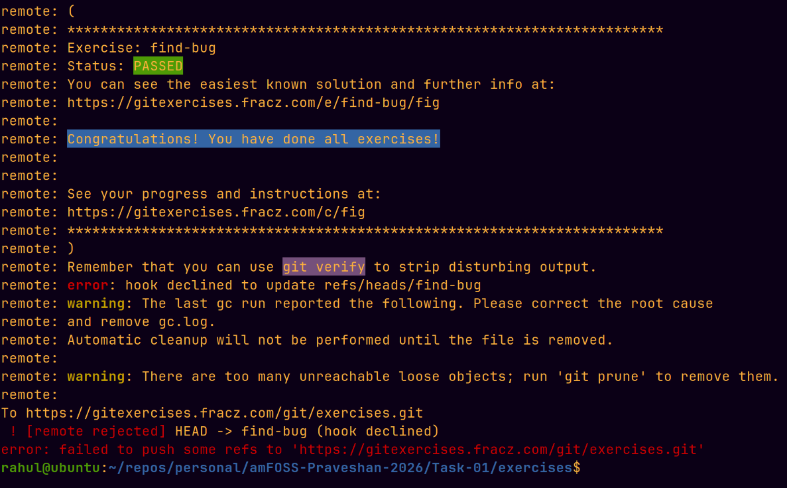

# Task-01 — Git Exercises

This Directory contains my notes while completing the Git Exercises.

I completed the **git-exercises by fracz** set, which has 23 Git challenges.

---

## 1. master (warm-up)

```bash
git verify
```

**What I understood:** This one was basically a warm-up. The setup already gives us `test.txt`, so I just had to verify/push the existing commit. The server checks that the expected file and content are there.

## 2. commit-one-file

```bash
git start commit-one-file
git add A.txt
git commit -m "Commit A.txt file"
git verify
```

**What I understood:** Both files were there, but I only needed to commit `A.txt`. `git add` stages a specific file, and `git commit` only includes what is staged, so `B.txt` stays untouched.

## 3. commit-one-file-staged

```bash
git start commit-one-file-staged
git reset A.txt
git commit -m "Commit B.txt file"
git verify
```

**What I understood:** This was the reverse of the previous one. Both files were staged already, so I used `git reset A.txt` to unstage only `A.txt`, then committed `B.txt`.

## 4. ignore-them

```bash
git start ignore-them
printf '*.o\n*.exe\n*.jar\nlibraries/\n' > .gitignore
git add .gitignore
git commit -m "Ignore binary files"
git verify
```

**What I understood:** I created a `.gitignore` for the required file types and the `libraries/` folder. The important part here was that the slash makes `libraries/` a directory rule.

## 5. chase-branch

```bash
git start chase-branch
git merge escaped
git verify
```

**What I understood:** `escaped` was already ahead of the current branch, so merging it was just a fast-forward. No new merge commit was needed.

## 6. merge-conflict

```bash
git start merge-conflict
git merge another-piece-of-work
# CONFLICT in equation.txt
echo 2+3=5 > equation.txt
git add equation.txt
git commit --no-edit
git verify
```

**What I understood:** Both branches changed the same line, so Git stopped with a conflict. I fixed `equation.txt` manually, staged it, and completed the merge. This was my first proper conflict-resolution exercise.

## 7. save-your-work

```bash
git start save-your-work
git stash
# removed the line "THIS IS A BUG - remove the whole line to fix it." from bug.txt
git commit -am "Fix a bug"
git stash pop
echo "Finally, finished it!" >> bug.txt
git commit -am "Finish my work"
git verify
```

**What I understood:** I had unfinished work that I didn't want mixed into the bug fix. `git stash` let me temporarily put that work aside, make the fix, and then bring my changes back with `git stash pop`.

## 8. change-branch-history

```bash
git start change-branch-history
git rebase hot-bugfix
git verify
```

**Explanation:** The bug was fixed on a side branch (`hot-bugfix`). Instead of merging, we want the
history to read as if the fix came first: `base → bugfix → my issue work`. `git rebase hot-bugfix`
replays the current branch's commits on top of `hot-bugfix`, so the "Work on an issue" commit now
sits above "Bug fix". The server checks the last commit is "Work on an issue", the one below is
"Bug fix", and that each touches the right file.

## 9. remove-ignored

```bash
git start remove-ignored
git rm ignored.txt
git commit -am "Remove the file that should have been ignored"
git verify
```

**What I understood:** `.gitignore` doesn't magically remove files that Git is already tracking. Since `ignored.txt` was already tracked, I had to remove it with `git rm`.

## 10. case-sensitive-filename

```bash
git start case-sensitive-filename
git mv File.txt file.txt
git commit -am "Lowercase file.txt"
git verify
```

**What I understood:** This was about changing only the filename's capitalization. `git mv` handled the rename and staged it at the same time.

## 11. fix-typo

```bash
git start fix-typo
# edited file.txt: changed "Hello wordl" into "Hello world"
git commit -a --amend
# in the editor, also changed the message "Add Hello wordl" to "Add Hello world"
git verify
```

**What I understood:** The typo was in the latest commit, so making another commit wasn't necessary. I amended the previous commit and fixed both the file and the commit message.

## 12. forge-date

```bash
git start forge-date
git commit --amend --no-edit --date="1987-08-03"
git verify
```

**What I understood:** This one was about changing the author date of the latest commit. `--amend` rewrites the commit and `--date` sets the required date.

## 13. fix-old-typo

```bash
git start fix-old-typo
git rebase -i HEAD~2
# in the todo list changed the "pick" line of "Add Hello wordl" to "edit", save & exit
#   now fixed file.txt: "Hello wordl" to "Hello world"
git add file.txt
git commit --amend -m "Add Hello world"     # fix the old commit's message too
git rebase --continue
#   a conflict appears — set file.txt to:
#     Hello world
#     Hello world is an excellent program.
git add file.txt
git rebase --continue
git verify
```

**What I understood:** The bad commit wasn't the latest one, so I used interactive rebase. I marked the older commit as `edit`, fixed it, amended it, and continued the rebase. The newer commit then had a small conflict because it was based on the old version.

## 14. commit-lost

```bash
git start commit-lost
git reflog
# found the commit whose message is "Very imporant piece of work", note its hash (shown as HEAD@{1})
git reset --hard HEAD@{1}
git verify
```

**What I understood:** I learned that an amended commit isn't instantly gone. `git reflog` keeps track of previous `HEAD` positions, so I could find the old commit and reset back to it.

## 15. split-commit

```bash
git start split-commit
git reset HEAD^
git add first.txt
git commit -m "First.txt"
git add second.txt
git commit -m "Second.txt"
git verify
```

**What I understood:** One commit had two separate changes. I reset the commit while keeping the actual changes, then staged and committed each file separately.

## 16. too-many-commits

```bash
git start too-many-commits
git rebase -i HEAD~2
# changed the second line's "pick" to "f" (fixup), save & exit
git verify
```

**What I understood:** There were two commits that should really have been one. I used interactive rebase with `fixup` to combine them while keeping the first commit message.

## 17. executable

```bash
git start executable
git update-index --chmod=+x script.sh
git commit -m "Make script.sh executable"
git verify
```

**What I understood:** Git also stores whether a file is executable. `git update-index --chmod=+x` changed the file mode to executable and the commit saved that change.

## 18. commit-parts

```bash
git start commit-parts
git add -p file.txt
# The hunks get split with 's'; answer:
#   (1/4) y        -> stage "I forgot to add file header."         (task 1)
#   (2/4) y        -> stage the two "task 1" lines                 (task 1)
#   (3/4) n        -> skip "It works!" + "task 2" line             (leave for 2nd commit)
#   (4/4) y        -> stage "Task 1 is finished."                  (task 1)
git commit -m "First part of changes"
git commit -am "The rest of the changed"
git verify
```

**What I understood:** This was one of the more interesting ones. Everything was in one file, but the changes needed to be split into two commits. `git add -p` let me choose which parts of the diff to stage.

## 19. pick-your-features

```bash
git start pick-your-features
git cherry-pick feature-a
git cherry-pick feature-b
git cherry-pick feature-c
# CONFLICT in program.txt — resolved it, keeping both sides:
#   This is complete feature B
#   This is base version of the program.
#   It has only two lines at the beginning.
#   This is complete feature A
#   This is first part Feature C
#   This is second part of Feature C
git add -A
git cherry-pick --continue
git verify
```

**What I understood:** I needed selected commits from three different branches, not the whole branches. `git cherry-pick` was perfect for that. `feature-c` caused a conflict, which I resolved manually before continuing.

## 20. rebase-complex

```bash
git start rebase-complex
git rebase issue-555 --onto your-master
git verify
```

**What I understood:** This one needed a slightly more specific rebase. `--onto` let me take only the commits I wanted and move them onto `your-master`, skipping the `issue-555` history.

## 21. invalid-order

```bash
git start invalid-order
git rebase -i HEAD~2
# swapped the two lines so that "This should be the second commit" is on top, save & exit
git verify
```

**Explanation:** Two feature commits are in the wrong order. Interactive rebase rewrites the order and
replays the commits in the new sequence. Because the commits touch different files, no conflict
occurs. The server checks commit order + file contents (`first.txt` → `1` below `second.txt` → `2`).

## 22. find-swearwords

```bash
git start find-swearwords
git log -S shit --oneline
# noted the 3 commits that introduced "shit" (used the OLDEST one as the rebase base)
git rebase -i <oldest-shit-commit>^
# in the todo list changed "pick" to "edit" for those 3 commits, save & exit
#   at each of the 3 stops:
#     sed -i 's/shit/flower/' <words.txt or list.txt>   (the file containing the word)
#     git add .
#     git commit --amend --no-edit
#     git rebase --continue
git verify
```

**Explanation:** `git log -S shit` finds every commit that *changed the number of occurrences* of the
string `shit` — i.e. the commits that introduced it. Interactive rebase rewrites history so those
commits now add `flower` instead; `edit` stops Git after each one so we can amend it before
continuing. `--amend --no-edit` rewrites the commit keeping its message, so the commit *count* stays
the same. The server checks that the three culprit commits now end with the word `flower` (and no
`shit`).

## 23. find-bug

```bash
git start find-bug
git bisect start
git bisect bad
git bisect good 1.0
git bisect run sh -c "openssl enc -base64 -A -d < home-screen-text.txt | grep -v jackass"
# when bisect finishes, HEAD is at the first commit that introduced "jackass"
git push origin HEAD:find-bug
```

**Explanation:** The bug (word `jackass`) is hidden deep in history — the text is base64-encoded in
the committed file and changed ~300 times, so reading it commit-by-commit is infeasible. `git bisect`
performs a binary search between a known-good commit (tag `1.0`) and a known-bad one (`HEAD`).
`git bisect run` automates it: at each checkout it runs the test — decode `home-screen-text.txt` and
`grep -v jackass`, which exits 0 (good) when the word is absent and 1 (bad) when present. Bisect
converges on the exact first bad commit, which we push as `find-bug`. The server checks the pushed
commit contains `jackass` while its parent does not.

---

## Proof of completion



## What I got from this task

This task started pretty simple, but the later exercises got much more interesting.
I got to practice things I hadn't really used before, especially `rebase`, `reflog`, `cherry-pick`,
`git add -p` and `git bisect`.
