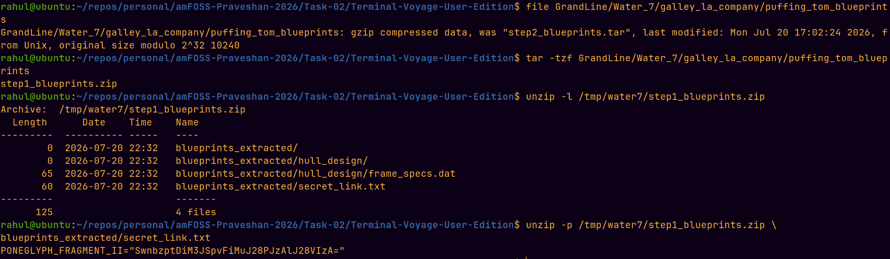

# Level 4 - Water 7

The Water 7 directory contained a file named:

```text
puffing_tom_blueprints
```

It did not have a normal file extension, so I used the `file` command instead
of trusting the filename.

```bash
file GrandLine/Water_7/galley_la_company/puffing_tom_blueprints
```

It showed that the file was actually gzip-compressed data.

I listed its contents without extracting it:

```bash
tar -tzf GrandLine/Water_7/galley_la_company/puffing_tom_blueprints
```

This revealed:

```text
step1_blueprints.zip
```

I extracted that archive to a temporary directory and inspected the ZIP:

```bash
unzip -l /tmp/water7/step1_blueprints.zip
```

It contained a `secret_link.txt` file and a decoy
`frame_specs.dat` file.

The secret file contained:

```text
PONEGLYPH_FRAGMENT_II="SwnbzptDiM3JSpvFiMuJ28PJzAlJ28VIzA="
```

The other file only contained decoy data, so I kept the Poneglyph fragment.

## Poneglyph Fragment II

`SwnbzptDiM3JSpvFiMuJ28PJzAlJ28VIzA=`

## Screenshot

