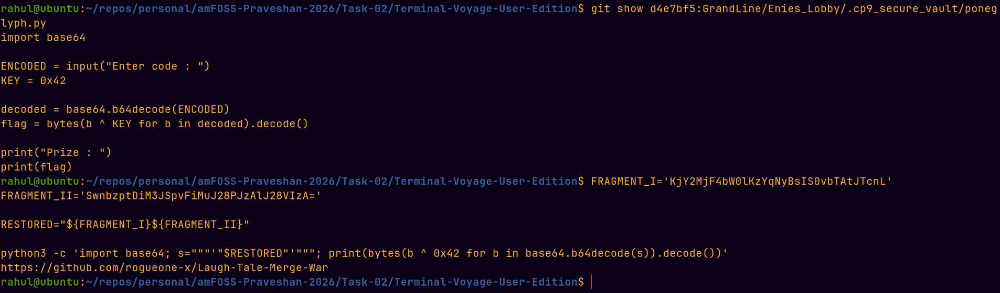

# Level 5 - The Buster Call Timeline Recovery

The Buster Call had erased the Level 5 files from the current timeline, so I
used Git history to travel back to the last peaceful state.

I first inspected the Git history:

```bash
git log --all --oneline --decorate --graph
```

This showed the Level 5 history:

```text
d4e7bf5 Level 5 : Vault Sealed
23b4e67 Vaults REMOVED, Evidences ERASED
c337460 Vaults REMOVED, Evidences ERASED
```

The `d4e7bf5` commit was the last peaceful moment before the files were
removed.

I inspected the historical Level 5 files directly from that commit instead
of changing the current branch:

```bash
git show d4e7bf5:GrandLine/Enies_Lobby/.cp9_secure_vault/poneglyph.py
```

The `poneglyph.py` program showed that the final inscription had to be
Base64-decoded and then XORed with `0x42`.

The Level 5 README explained that the Poneglyph inscription had been split
into two fragments and that both fragments had to be restored before
deciphering.

The fragments recovered from the previous levels were:

```text
Fragment I:
KjY2MjF4bW0lKzYqNyBsIS0vbTAtJTcnL

Fragment II:
SwnbzptDiM3JSpvFiMuJ28PJzAlJ28VIzA=
```

After restoring the two fragments and decoding the resulting inscription
using the Level 5 decoder, it revealed the next destination:

```text
https://github.com/rogueone-x/Laugh-Tale-Merge-War
```

This repository became the starting point for the final merge challenge.

## Screenshot

