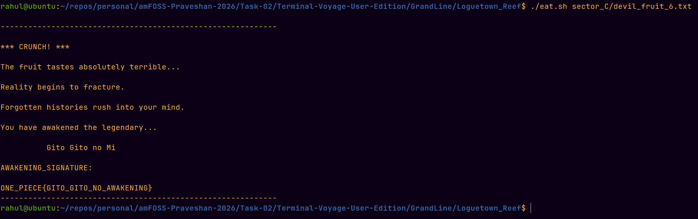
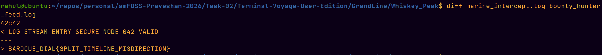
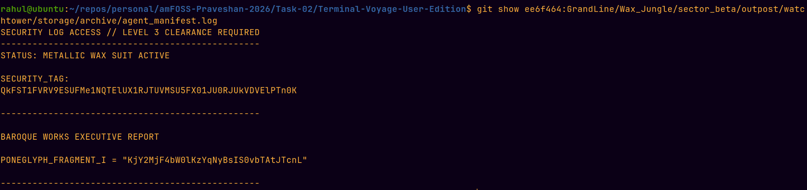
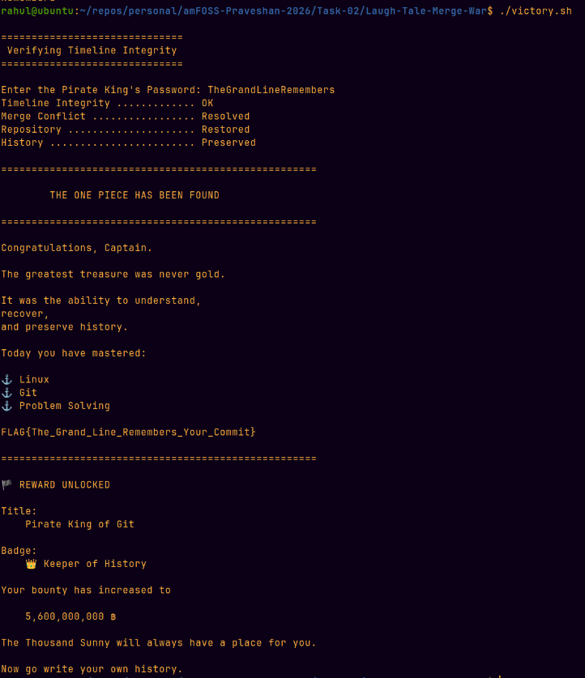

# Task-02: Terminal Voyage - The Grand Line

A terminal-based investigation through Git history, hidden files, archives,
encodings, and merge conflicts.

The voyage consists of six levels, beginning at Loguetown and ending at
Laugh Tale.

---

# LEVEL 1 — LOGUETOWN

I started by checking the provided `eat.sh` script to understand how the
Devil Fruit was supposed to be found.

The important part was the executable check:

```bash
if [[ -x "$FRUIT" ]]
```

So instead of opening all the files one by one, I searched for executable
files using:

```bash
find . -type f -executable
```

This showed:

```text
./eat.sh
./sector_C/devil_fruit_6.txt
```

`eat.sh` was obviously the script itself, so the actual Devil Fruit was:

```text
sector_C/devil_fruit_6.txt
```

I then used the provided script to eat it:

```bash
./eat.sh sector_C/devil_fruit_6.txt
```

This revealed the awakening signature:

```text
ONE_PIECE{GITO_GITO_NO_AWAKENING}
```

## Flag

```text
ONE_PIECE{GITO_GITO_NO_AWAKENING}
```

## Screenshot



---

# LEVEL 2 — WHISKEY PEAK

The current `Whiskey_Peak` directory only contained `feast_manifest.txt`, so I
checked the Git history of the directory.

I found a previous commit:

```text
bc5aff3 Level 2: Implemented
```

Using `git show`, I found a hidden script that had existed in that commit:

```text
.baroque_works_cache/unlock_vault.sh
```

The script required the `AWAKENING_SIGNATURE` from Level 1, so I exported it:

```bash
export AWAKENING_SIGNATURE='ONE_PIECE{GITO_GITO_NO_AWAKENING}'
```

I restored the historical script and ran it. It generated two log files:

```text
marine_intercept.log
bounty_hunter_feed.log
```

The script itself suggested comparing them with `diff`, so I ran:

```bash
diff marine_intercept.log bounty_hunter_feed.log
```

The only difference was on line 42:

```text
42c42
< LOG_STREAM_ENTRY_SECURE_NODE_042_VALID
---
> BAROQUE_DIAL{SPLIT_TIMELINE_MISDIRECTION}
```

This revealed the Level 2 clue.

## Clue

```text
BAROQUE_DIAL{SPLIT_TIMELINE_MISDIRECTION}
```

## Screenshot



---

# LEVEL 3 — WAX JUNGLE

The Wax Jungle directory in the current timeline only contained `.gitkeep`,
so I checked the Git history for the directory.

```bash
git log --all --oneline -- GrandLine/Wax_Jungle
```

This revealed the Level 3 implementation commit:

```text
ee6f464 Level 3: Implemented
```

Instead of checking out all the reports, I searched the historical commit
directly:

```bash
git grep -ni 'SPLIT\|TIMELINE\|MISDIRECTION\|BAROQUE' ee6f464 -- GrandLine/Wax_Jungle
```

This led to:

```text
GrandLine/Wax_Jungle/sector_beta/outpost/watchtower/storage/archive/agent_manifest.log
```

I inspected that file directly from the commit:

```bash
git show ee6f464:GrandLine/Wax_Jungle/sector_beta/outpost/watchtower/storage/archive/agent_manifest.log
```

The report contained a security tag and the following Poneglyph fragment:

```text
PONEGLYPH_FRAGMENT_I = "KjY2MjF4bW0lKzYqNyBsIS0vbTAtJTcnL"
```

I also decoded the security tag and confirmed that it contained the Level 2
clue:

```text
BAROQUE_DIAL{SPLIT_TIMELINE_MISDIRECTION}
```

The Poneglyph fragment is kept exactly as found because it is a fragment
that may be needed later in the voyage.

## Poneglyph Fragment I

```text
KjY2MjF4bW0lKzYqNyBsIS0vbTAtJTcnL
```

## Screenshot



---

# LEVEL 4 — WATER 7

The Water 7 directory contained a file named:

```text
puffing_tom_blueprints
```

It did not have a normal file extension, so I used the `file` command instead
of trusting the filename.

```bash
file GrandLine/Water_7/galley_la_company/puffing_tom_blueprints
```

It showed that the file was actually gzip-compressed data.

I listed its contents without extracting it:

```bash
tar -tzf GrandLine/Water_7/galley_la_company/puffing_tom_blueprints
```

This revealed:

```text
step1_blueprints.zip
```

I extracted that archive to a temporary directory and inspected the ZIP:

```bash
unzip -l /tmp/water7/step1_blueprints.zip
```

It contained a `secret_link.txt` file and a decoy
`frame_specs.dat` file.

The secret file contained:

```text
PONEGLYPH_FRAGMENT_II="SwnbzptDiM3JSpvFiMuJ28PJzAlJ28VIzA="
```

The other file only contained decoy data, so I kept the Poneglyph fragment.

## Poneglyph Fragment II

```text
SwnbzptDiM3JSpvFiMuJ28PJzAlJ28VIzA=
```

## Screenshot


---

# LEVEL 5 — THE BUSTER CALL TIMELINE RECOVERY

The Buster Call had erased the Level 5 files from the current timeline, so I
used Git history to travel back to the last peaceful state.

I first inspected the Git history:

```bash
git log --all --oneline --decorate --graph
```

This showed the Level 5 history:

```text
d4e7bf5 Level 5 : Vault Sealed
23b4e67 Vaults REMOVED, Evidences ERASED
c337460 Vaults REMOVED, Evidences ERASED
```

The `d4e7bf5` commit was the last peaceful moment before the files were
removed.

I inspected the historical Level 5 files directly from that commit instead
of changing the current branch:

```bash
git show d4e7bf5:GrandLine/Enies_Lobby/.cp9_secure_vault/poneglyph.py
```

The `poneglyph.py` program showed that the final inscription had to be
Base64-decoded and then XORed with `0x42`.

The Level 5 README explained that the Poneglyph inscription had been split
into two fragments and that both fragments had to be restored before
deciphering.

The fragments recovered from the previous levels were:

```text
Fragment I:
KjY2MjF4bW0lKzYqNyBsIS0vbTAtJTcnL

Fragment II:
SwnbzptDiM3JSpvFiMuJ28PJzAlJ28VIzA=
```

After restoring the two fragments and decoding the resulting inscription
using the Level 5 decoder, it revealed the next destination:

```text
https://github.com/rogueone-x/Laugh-Tale-Merge-War
```

This repository became the starting point for the final merge challenge.

## Screenshot


---

# LEVEL 6 — THE GREAT MERGE WAR AT LAUGH TALE

The decoded message from Level 5 led to the `Laugh-Tale-Merge-War`
repository.

The repository had two branches containing different versions of the same
Poneglyph fragments:

- `ancient_history`
- `pirate_king_path`

Both branches were based on the same initial history, but their versions of
the treasure files contained different parts of the inscription.

I compared both branches with their common ancestor:

```bash
git diff 34b8f9a..8835d14 -- .
git diff 34b8f9a..091591f -- .
```

The conflicting parts were:

```text
key_part_1.txt

ancient_history:     Line
pirate_king_path:    TheGrand
```

and:

```text
key_part_2.txt

ancient_history:     bers
pirate_king_path:    Remem
```

I merged the `pirate_king_path` branch into `ancient_history`:

```bash
git merge origin/pirate_king_path
```

This produced merge conflicts in both treasure files.

I resolved the conflicts by combining the complementary parts:

```text
TheGrand + Line = TheGrandLine

Remem + bers = Remembers
```

The completed inscription was therefore:

```text
TheGrandLine
Remembers
```

After resolving the conflicts, I committed the merge:

```bash
git add treasure/key_part_1.txt treasure/key_part_2.txt
git commit -m "Reconcile ancient histories"
```

The final password was:

```text
TheGrandLineRemembers
```

I entered this password into `victory.sh`:

```bash
./victory.sh
```

The repository accepted the restored history and revealed the final flag:

```text
FLAG{The_Grand_Line_Remembers_Your_Commit}
```

## Screenshot



---

# FINAL FLAG

```text
FLAG{The_Grand_Line_Remembers_Your_Commit}
```

---

# PONEGLYPH FRAGMENTS RECOVERED

## Fragment I

```text
KjY2MjF4bW0lKzYqNyBsIS0vbTAtJTcnL
```

## Fragment II

```text
SwnbzptDiM3JSpvFiMuJ28PJzAlJ28VIzA=
```

After restoring and decoding the fragments in Level 5, the next destination
was:

```text
https://github.com/rogueone-x/Laugh-Tale-Merge-War
```

The two histories in Level 6 supplied complementary pieces of the final
inscription:

```text
TheGrand + Line = TheGrandLine
Remem + bers = Remembers
```

This produced the final password:

```text
TheGrandLineRemembers
```

which unlocked the final flag:

```text
FLAG{The_Grand_Line_Remembers_Your_Commit}
```

---

# COMPLETION

The voyage covered:

- Linux command-line investigation
- Executable file discovery
- Git history investigation
- Recovery of deleted historical files
- Environment variables
- Log comparison with `diff`
- Searching Git history with `git grep`
- Archive and compression identification
- TAR and ZIP extraction
- Base64 decoding
- XOR-based decoding
- Git branches
- Merge conflict resolution
- Repository history recovery

The final repository accepted the reconciled history and confirmed:

```text
Timeline Integrity ............. OK
Merge Conflict ................. Resolved
Repository ..................... Restored
History ........................ Preserved
```