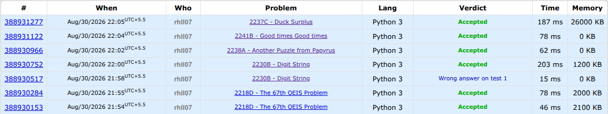

# Task-04: The Pirate King's Challenge

This task was basically five competitive programming problems from Codeforces.

I solved all five problems in Python and submitted them to Codeforces.

## Problems

### 1. The 67th OEIS Problem

The goal was to create a sequence where the GCD of every two neighbouring
numbers is different.

The trick I used was to take consecutive prime numbers and make each element
the product of two neighbouring primes.

For example:

```text
2, 3, 5, 7, 11

=> 2×3, 3×5, 5×7, 7×11
=> 6, 15, 35, 77
```

Now the GCDs are:

```text
gcd(6, 15)  = 3
gcd(15, 35) = 5
gcd(35, 77) = 7
```

Since the primes are different, all the GCDs are different too.

---

### 2. Digit String

We are given a string containing only the digits `1`, `2`, `3` and `4`.
We have to delete as few characters as possible so that no subsequence of
the remaining string forms a number divisible by 4.

The important observation is that divisibility by 4 depends only on the last
two digits.

I used a simple prefix/suffix approach. I keep track of how many `2`s can be
kept on the left and how many `1`s or `3`s can be kept on the right.

I try every possible split and keep the maximum number of characters that can
stay. The answer is then:

```text
original length - maximum characters kept
```

This runs in `O(n)` time.

---

### 3. Another Puzzle from Papyrus

Here we have two arrays `a` and `b`. We can decrease elements of `a`, and we
can also reorder the whole array at a fixed cost.

The first thing I check is whether `a` can already be changed into `b`
without reordering.

If that is not possible, I sort both arrays and check again. Since reordering
does not change the total sum of the elements, the number of decrements needed
is simply:

```text
sum(a) - sum(b)
```

So there are basically two possibilities:

```text
No reorder:
sum(a) - sum(b)

Reorder once:
c + sum(a) - sum(b)
```

If neither arrangement works, the answer is `-1`.

---

### 4. Good times Good times

This one had a really nice trick.

An integer is called good if it contains at most two different digits. We need
to find a `y` such that both `y` and `x × y` are good.

I used:

```text
y = 10^d + 1
```

where `d` is the number of digits in `x`.

For example, if:

```text
x = 73
d = 2
y = 101
```

then:

```text
73 × 101 = 7373
```

So `y` has only the digits `0` and `1`, while `x × y` has exactly the same
digits as `x`.

Since `x` itself is already guaranteed to be good, both numbers are good.

---

### 5. Duck Surplus

This one was about repeatedly fixing adjacent piles whenever the left pile is
larger than the right pile.

For a pair:

```text
a[i] > a[i+1]
```

the operation changes:

```text
[a[i], a[i+1]]
```

into:

```text
[a[i+1], a[i] + a[i+1]]
```

I simulated this greedily from left to right. Whenever an adjacent pair is
out of order, I immediately apply the operation.

The value that ends up at the last position gives the minimum possible value
of the largest pile.

The solution only needs one pass through the array, so it runs in `O(n)` time.

---

## What I learned

This task was mostly about looking for the right observation.
The biggest things I learned were:

- Constructive problem solving
- GCD and prime-based constructions
- Prefix/suffix thinking
- Greedy algorithms
- Sorting as a way to simplify array problems
- Looking for patterns in number problems
- Writing solutions that are fast enough for large inputs

## Proof of Completion

