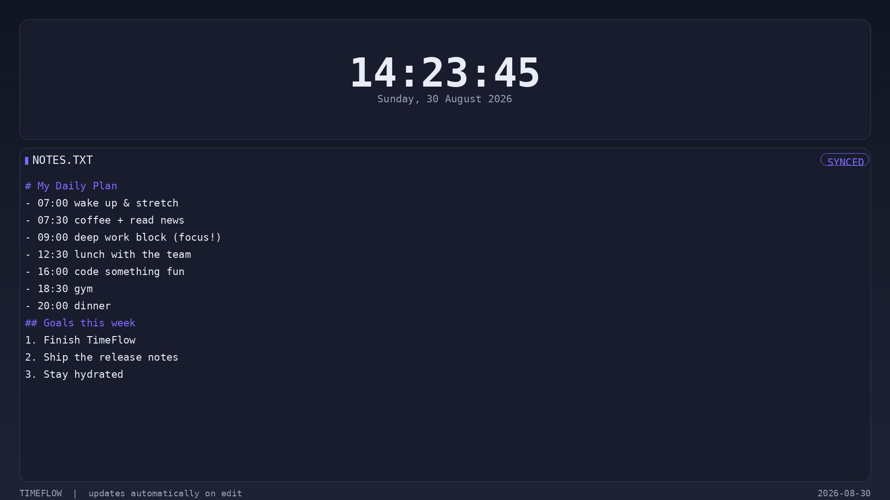
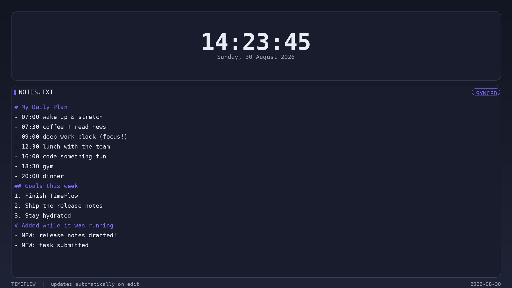
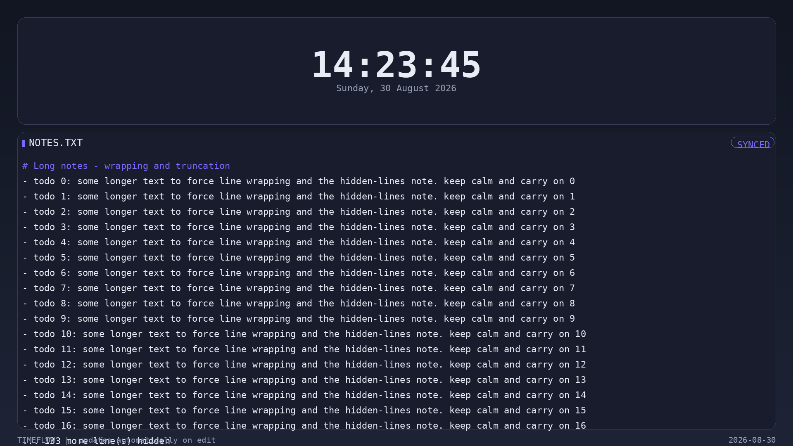
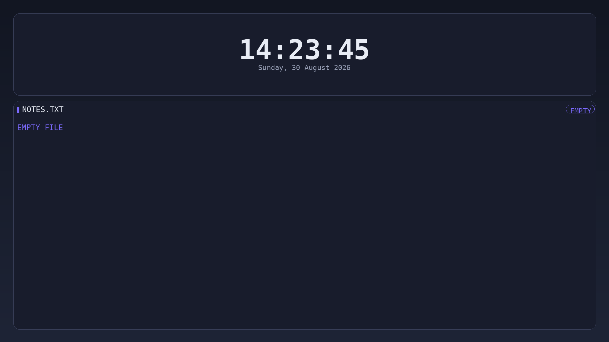
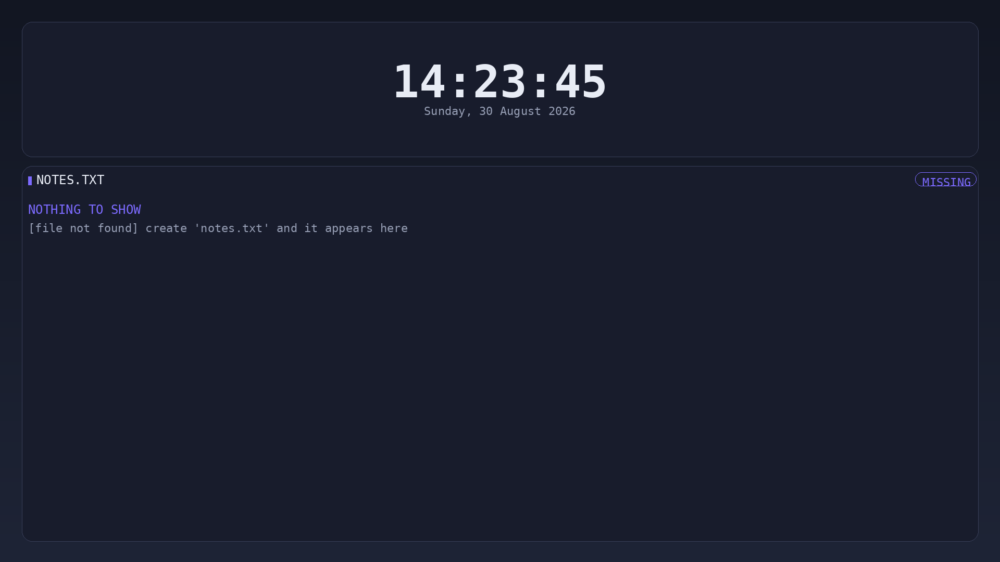

# Task-11: TimeFlow — Live Wallpaper Sync

TimeFlow is a small Python program that turns a text file into a live desktop
wallpaper.

The idea is pretty simple: I can keep my notes, plans or schedule on my
desktop, while a clock with seconds keeps updating in real time.

If I edit the text file, the wallpaper updates automatically without restarting
the program.

## What it does ?

- Reads text from a `.txt` file and puts it on the wallpaper.
- Shows the current time with seconds and the date.
- Updates the clock every second.
- Detects changes to the text file and updates the wallpaper automatically.
- Handles long text files by wrapping the content and hiding extra lines.
- Handles empty and missing files without crashing.
- Saves the generated wallpaper as a PNG.
- Automatically sets the generated image as the desktop wallpaper.
- Tested on Ubuntu GNOME with Wayland.

## How to run

### 1. Install the dependency

```bash
pip install -r requirements.txt
```

If Ubuntu doesn't allow installing packages directly into the system Python,
create a virtual environment:

```bash
python3 -m venv .venv
.venv/bin/pip install -r requirements.txt
```

### 2. Create the text file

The program looks for `notes.txt` by default.

For example:

```bash
echo "# My Daily Plan" > notes.txt
echo "- Work on amFOSS tasks" >> notes.txt
echo "- Build something cool" >> notes.txt
```

### 3. Start TimeFlow

```bash
python3 timeflow.py
```

To use another text file:

```bash
python3 timeflow.py -f myfile.txt
```

Leave the program running. Press `Ctrl+C` when you want to stop it.

## How it works

The basic flow is:

```text
notes.txt
   ↓
TimeFlow
   ↓
Pillow renders the text + clock
   ↓
PNG wallpaper
   ↓
GNOME desktop
```

The program checks the text file for changes. When the file is edited, the
content is rendered again.

The clock is refreshed every second.

On GNOME, the wallpaper is saved using a new filename for each frame. This
makes GNOME notice the wallpaper change properly, especially on Wayland.
Older generated frames are cleaned up automatically.

## Screenshots

### 1. Initial wallpaper

The normal wallpaper with the clock, date and contents of `notes.txt`.



### 2. After editing the file

The text file was edited while TimeFlow was running, and the new content
appeared on the wallpaper automatically.



### 3. Long text file

A long text file is wrapped to fit the screen. If there is more content than
can fit, TimeFlow shows how many lines were hidden instead of overflowing.



### 4. Empty file

An empty `notes.txt` does not crash the program. It shows a small message
instead.



### 5. Missing file

If `notes.txt` is missing, TimeFlow shows a message instead of crashing.
Creating the file again lets it recover automatically.



## Some things I learned

This task taught me more about working with files in Python, image generation
with Pillow, detecting file changes and interacting with the Linux desktop.

The GNOME/Wayland wallpaper part was probably the most annoying part. Simply
rewriting the same PNG was not always enough for GNOME to notice that the
wallpaper had changed, so I had to make each generated frame use a different
filename.

I also learned that small things like checking for an empty or missing file
matter when making a program that is supposed to keep running continuously.

## Dependency

The only external Python dependency is:

```text
Pillow
```
